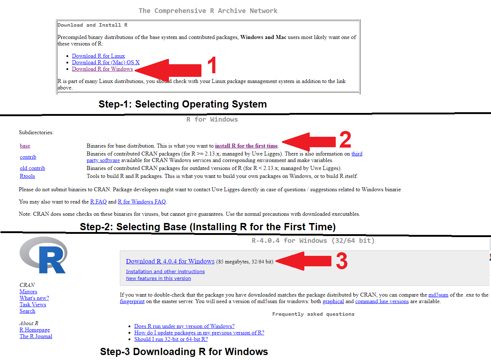

## Download
To install R, visit [The Comprehensive R Archive Network (or CRAN)](https://cloud.r-project.org) and download the latest version of R for your Windows or Mac or Linux.

When you have downloaded and installed R, you can run R on your computer as any other computer sofware.

## Version
R community is very dynamic, and therefore it is quite common that several versions are launched in the same year. Updating the R version is as easy as download the new version in the URL provided above and install it. The installation of the new versions is not overwritten over the old version, that is why it is possible to use in your computer as many R versions as you have installed.

## R-GUI
For the case of Windows, the software managing the R console is R-GUI (or Graphical User Interface), which interface is shown in Figure below. R-Gui has all functionalities of R, it allows to type and execute codes (commonly know as R-scripts).
